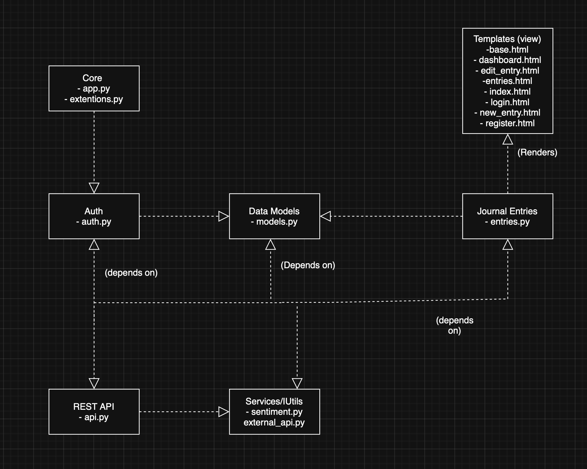
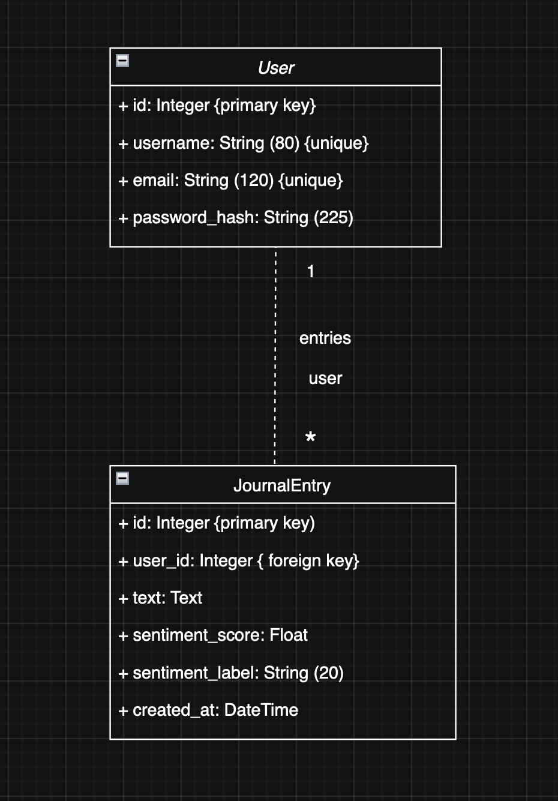
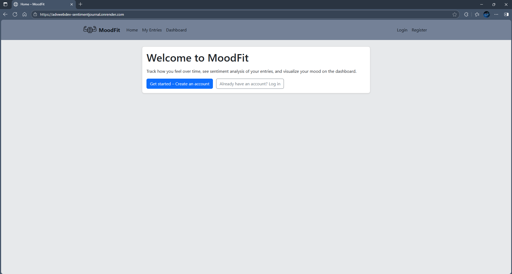
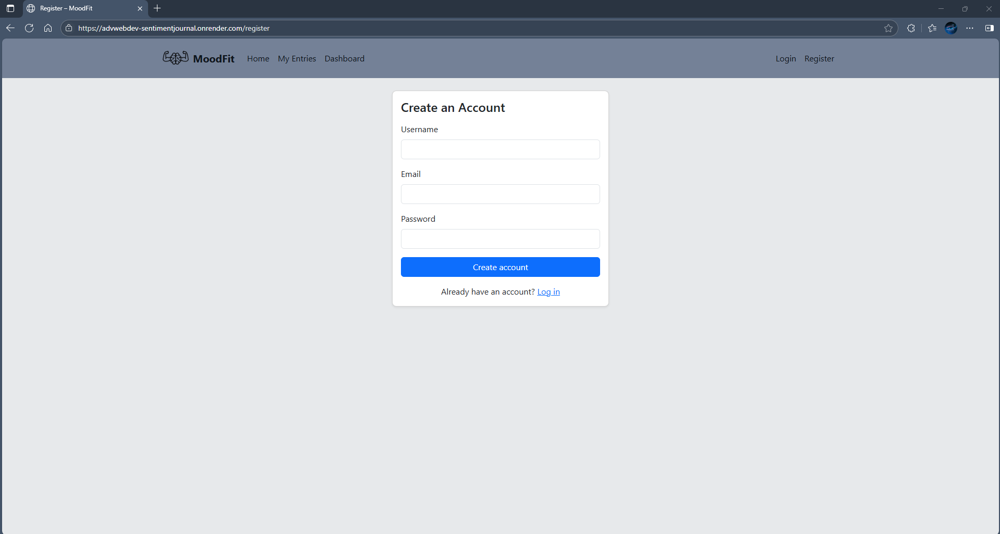
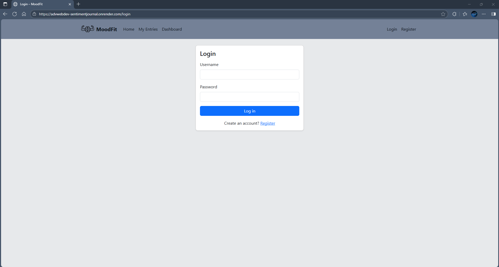
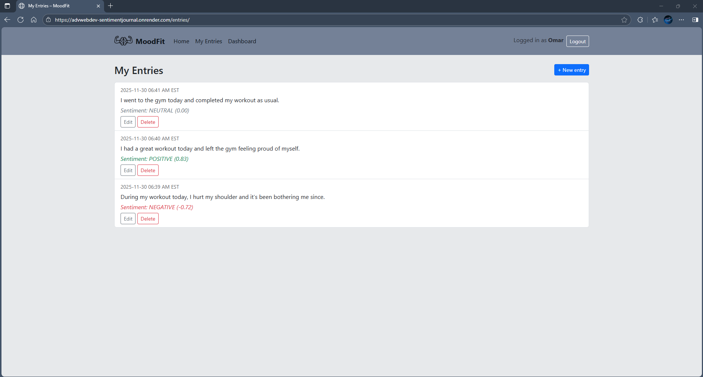
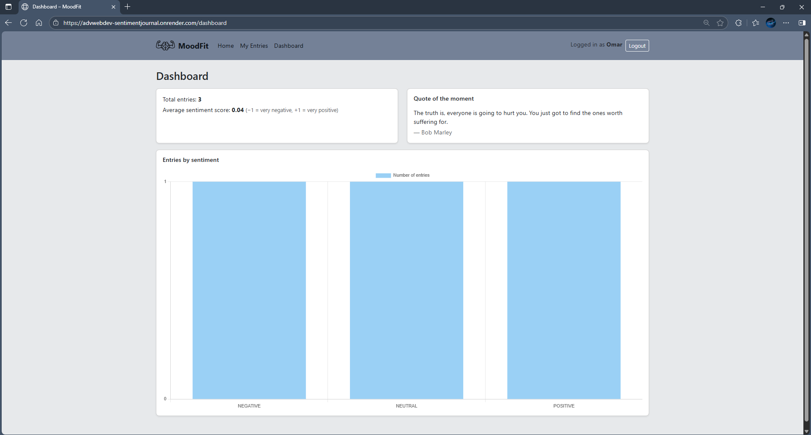

# MoodFit – Sentiment Journal

## Live Deployment

https://advwebdev-sentimentjournal.onrender.com

The Render service may take a few seconds to start up after inactivity.

## Introduction

MoodFit is a sentiment journaling app that lets users write daily reflections, track mood changes, and view emotional trends. Each entry is analyzed with VADER sentiment analysis, and the system includes authentication, full CRUD support, analytics dashboards, external quote API integration, and automated testing.

## System Overview

MoodFit is built as a modular Flask application that includes secure user authentication, journal entry storage in an SQLite database using SQLAlchemy as the ORM, automatic sentiment analysis for each entry, and a dynamic dashboard that visualizes emotional trends. The system also integrates an external API for motivational quotes, provides a REST API for front-end communication, and supports CI/CD through GitHub Actions. Deployment is fully Docker-compatible, and the project follows a clean MVC-style structure within the src/ directory.

## Architecture Diagrams

## UML Package Diagram


Figure 1. Package-level architecture showing the main modules of the MoodFit system.

## UML Class Diagram


Figure 2. Data model showing User-JournalEntry relationship.

## How to Run (Locally)

## Step 1

- Clone the repository:

```bash
git clone https://github.com/momarsafi2/AdvWebDev-SentimentJournal.git
cd AdvWebDev-SentimentJournal
```

## Step 2

- Create & activate virtual environment

## For Windows:

```bash
python -m venv venv
venv\Scripts\activate
```

## For Mac/Linux:

```bash
python3 -m venv venv
source venv/bin/activate
```

## Step 3

- Install dependencies

```bash
pip install -r requirements.txt
```

## Step 4

- Run the Flask app

```bash
flask --app src run
```

## Step 5

- The app will be available to you at:

```bash
http://127.0.0.1:5000
```

## Run with Docker

## 1. Build image

```bash
docker build -t moodfit-app .
```

## 2. Run container

```bash
docker run -p 5000:5000 moodfit-app
```

## Testing

## Run all tests:

```bash
pytest
```

## Run tests but skip Selenium (CI Mode)

```bash
pytest -k "not test_homepage_e2e"
```

## Run with coverage

```bash
pytest --cov=src
```

## Tests include:

- Unit tests (sentiment, models, CRUD)
- Integration tests (API endpoints)
- Login + authentication tests
- End-to-end Selenium test (homepage loads)

## CI/CD – GitHub Actions

A workflow in: .github/workflows/ci.yml

Automatically runs when you push:

- Installs dependencies
- Runs all pytest tests
- Skips Selenium in CI
- Shows pass/fail badge

## API Specifications

GET /api/sentiment-summary

- Returns mood statistics for logged-in user.

POST /api/entries

- Create a new journal entry.

GET /api/entries

- Fetch all entries for the authenticated user.

GET /api/quote

- Returns random motivational quote (external API).

## Features

1. User Authentication (Register & Login): Secure account system using Flask-Login with hashed passwords and session-based access control.
2. Create New Journal Entries: Users can write and save mood or reflection entries with automatic timestamps.
3. Edit & Delete Entries: Full CRUD support. Users can update or remove their journal entries anytime.
4. Sentiment Analysis (VADER) Integration: Each entry is automatically analyzed to generate a sentiment score and label (positive, neutral, negative).
5. Dashboard Overview (Analytics Page): The Dashboard summarizes the user’s mood history. Includes: Total number of journal entries, average sentiment score, count of positive, neutral, and negative entries. Also visual chart/graph (via Chart.js) to show sentiment trends over time.
6. External Quote Integration: Fetches a new motivational quote from an external API to inspire the user on the dashboard.

## How to Use the Application

1. In the home page, click **Get started** or **Register** to create a new account.
2. Log in using your email and password.
3. Navigate to **My Entries**.
4. Click **New entry** to write and then save a journal entry.
5. The system automatically performs sentiment analysis after saving.
6. Navigate to the **Dashboard** to see a motivational quote, updated charts and mood statistics based on your entries.
7. You can view, edit, or delete any past entries.
8. Refresh the dashboard page to load a new motivational quote.

## Screenshots

## **Home Page**



## **Register**



## **Login**



## **My Entries**



## **Dashboard**



## Performance Optimization (PageSpeed Insights)

## Group Members

- Omar Safi - 100830933
- Roya Salihi
